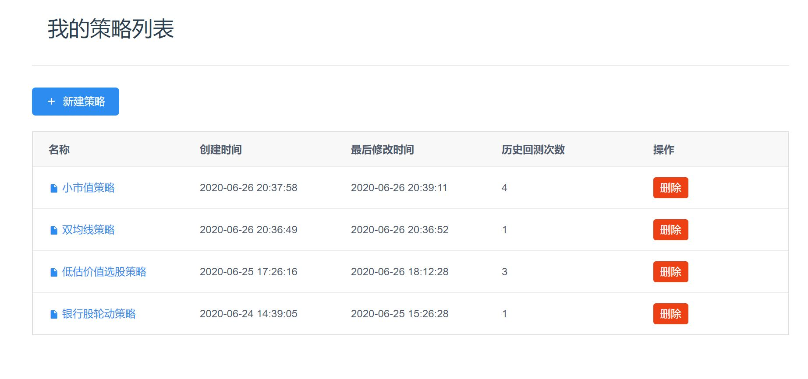

# 量化交易策略研究平台

> 同济大学软件学院2020年春季学期 .NET 期末课程项目

## 1 项目背景

### 1.1 量化交易

量化交易，也称为⾃动化交易、程序化交易。它是指以先进的数学模型替代⼈为的主观判断，利⽤计算机技术从庞⼤的历史数据中海选能带来超额收益的多种“⼤概率”事件以制定策略，极⼤地减少了投资者情绪波动的影响，避免在市场极度狂热或悲观的情况下作出⾮理性的投资决策。

概括来说，量化交易就是计算机程序代替⼈按照固定的策略⾃动化地完成投资交易。

### 1.2 量化交易中的策略

量化交易中最重要的部分是量化交易的策略，量化交易的策略决定了最终的收益。

量化交易的策略的⽣命周期主要包含以下5个环节：

产⽣想法 → 实现策略(编程) → 检验策略(回测) → 运⾏策略 → 策略失效。

其中，策略回测是指设定了某种策略后，基于历史已经发⽣过的真实⾏情数据，在历史上某⼀个时间点开始，严格按照设定的策略进⾏决策，并模拟真实⾦融市场交易的规则进⾏模型买⼊、模型卖出，得出⼀个时间段内的盈利率、最⼤回撤率等数据。

### 1.3 项目简介

本项⽬是⼀个量化交易策略研究平台，其主要功能是帮助量化交易投资者完成策略⽣命周期中的前3个环节，即将策略想法实现为程序代码，并对策略代码进⾏回测。

## 2 功能

- [x] 用户管理：用户注册，登录 
- [x] 策略管理：创建策略，删除策略，更新策略 
- [x] 策略回测：提交策略进行回测，回测进度显示 
- [x] 回测报告管理：Word报告生成，下载 
- [x] 数据管理：数据上传，下载

### 2.1 用户管理

### 2.2 策略管理

### 2.3 策略编写与回测

### 2.4 回测进度显示

### 2.5 Word报告生成与下载

### 2.6 数据管理

## 3 设计与实现

本项⽬前端使⽤vue.js框架进⾏构建， 使⽤iView组件构建界⾯， axios进⾏HTTP通信， CodeMirror提供前端代码编辑功能。

Web服务器采⽤.NET Framework框架，使⽤Entity Framework作为ORM框架进⾏数据库操作，采⽤NPOI进⾏Word⽂档的⽣成。

对于绝⼤多数请求，Web服务器可以独立完成。对于策略回测请求，Web服务器需要创建Python Runner线程，每⼀个Python Runner线程会启动⼀个回测引擎进程进行策略回测。

前后端通信采⽤HTTP协议通信和Websocket通信， Web服务器与Python Runner之间的通信采⽤消息队列NETMQ。

其中，⽐较重要的回测功能，其实现涉及如下细节：

1. 前后端通信：Websocket

2. Web服务器与Python Runner通信：消息队列NETMQ

3. 运行回测引擎：进程System.Diagnostics.Process

4. Python Runner发送消息到消息队列的触发：事件Event

5. 后端同时进行回测和维持通信：多线程Task

6. 设计Python Runnner实现解耦，便于应对更大规模的业务场景

## 4 部署

前端：
1. 安装 node.js 环境
2. 在 ../project/frontend/quant-backtest-fronted/ 目录下依次执行 npm install, npm run dev 命令

.NET后端：
1. 使用visual studio打开解决方案 ../project/backennd/Quant-BackTest-Backend/Quant-BackTest-Backend.sln
2. 保持默认生成配置（x86），点击生成解决方案进行编译
3. 将编译出的用户密码加密COM组件进行32位注册
4. 将编译出的Win32 DLL放至../project/backennd/Quant-BackTest-Backend/bin目录下以便引入
5. 直接通过Visual studio启动web api主程序，或根据需求部署至IIS

回测引擎：

python回测引擎采用了开源项目：https://github.com/youerning/stock_playground
如果需要执行回测请求，需要clone该回测引擎仓库，并在.NET代码中修改相应的路径